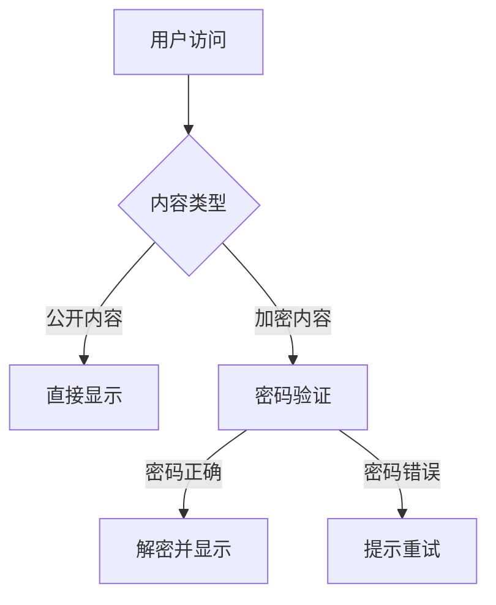

# 技术笔记（保密）

## 项目架构设计

### 核心思路

这个项目采用了一些独特的设计思路：



### 关键技术点

#### 1. 加密算法

- **算法**: AES-256-GCM
- **密钥派生**: PBKDF2 (100,000次迭代)
- **随机因子**: 每次加密使用新的盐值和IV

```javascript
// 示例代码（仅供参考）
const encrypted = encryptContent(content, password)
const decrypted = decryptContent(encrypted, password)
```

#### 2. 前端解密

使用 Web Crypto API 实现浏览器端解密：

```javascript
// 浏览器环境解密
const key = await deriveKey(password, salt)
const decrypted = await crypto.subtle.decrypt(
  { name: 'AES-GCM', iv: iv },
  key,
  encryptedData
)
```

#### 3. 安全考虑

- ✅ 密码不存储在代码中
- ✅ 加密文件可以安全提交到Git
- ✅ 即使仓库公开，内容也无法被解密
- ✅ 密码只在会话期间缓存

## 实现难点

### 难点1: 浏览器兼容性

Web Crypto API 需要 HTTPS 环境或 localhost。

**解决方案**:

- 开发环境使用 localhost
- 生产环境强制 HTTPS

### 难点2: 性能优化

解密操作需要一定的计算时间。

**优化措施**:

- 使用 SessionStorage 缓存密码
- 异步解密，显示加载状态
- 优化 PBKDF2 迭代次数

### 难点3: 用户体验

如何让密码输入体验更好？

**改进点**:

- 美观的模态对话框
- 密码显示/隐藏切换
- 清晰的错误提示
- 记住密码（会话级别）

## 未来改进方向

1. **多密码支持**: 不同文件夹使用不同密码
2. **密码提示**: 提供密码提示功能
3. **密码强度检查**: 建议用户使用强密码
4. **批量操作**: 支持批量加密/解密

## 内部资料

以下是一些敏感的技术资料和配置信息...

（此处省略具体内容）

---

**注意**: 本文档包含敏感技术信息，请勿分享给未授权人员。
